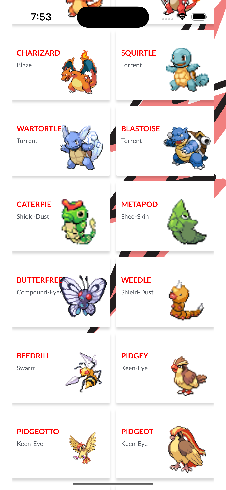
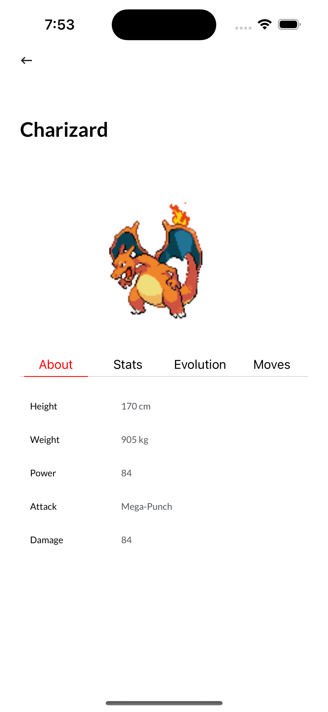

# Pokémon App

-----------------------------------------------------
<p float="left">
 
 
 
</p>

This repository contains the source code for the Pokémon app. This iOS application provides a general list of Pokémon and a detailed screen for each Pokémon. The application only supports portrait mode and requires a minimum of iOS 12 to run.


The design of the application can be found [here](https://www.figma.com/file/Aa4VRXeKfKN1s0Gww4FQ8v/Catch%E2%80%99em-all).

## Features

- Display Pokémon general list.
- Display detailed info about each Pokémon.
- Animated navigation from general to detail screen.
- Detail info caching.
- Portrait mode only.

## Tech Stack

- RxSwift/RxCocoa
- MVVM
- UIKit
- Auto Layout
- Code-only layout
- Third-party API
- Third-party libraries: Cocoapods

## How to Run the Project

1. Clone the repository: 
   ```
   git clone https://github.com/username/Pokemon-App.git
   ```
2. Navigate into the cloned repository: 
   ```
   cd Pokemon-App
   ```
3. Install the necessary pods: 
   ```
   pod install
   ```
4. Open the project in Xcode: 
   ```
   open Pokemon-App.xcworkspace
   ```
5. Select your simulator or device and click `Run`.

## Testing

We've implemented both UI and UX tests to ensure the quality and usability of the app. To run these tests, follow these steps:

1. Open the project in Xcode as outlined above.
2. Select `Product > Test` or simply press `Command + U`.
3. Wait for the tests to execute. Results will be shown in the left sidebar under the test navigator.

## API

We use the [PokéAPI](https://pokeapi.co) for getting data about the Pokémon.

## Contributing

We welcome contributions! Please see our [Contributing Guidelines](CONTRIBUTING.md) for more details.

## License

This project is licensed under the terms of the MIT license. See the [LICENSE](LICENSE.md) file for more info.

## Contact

Please raise an issue on this repo if you have any problems, questions, or suggestions. We welcome your feedback!

--- 

Have fun exploring the world of Pokémon with our app!
